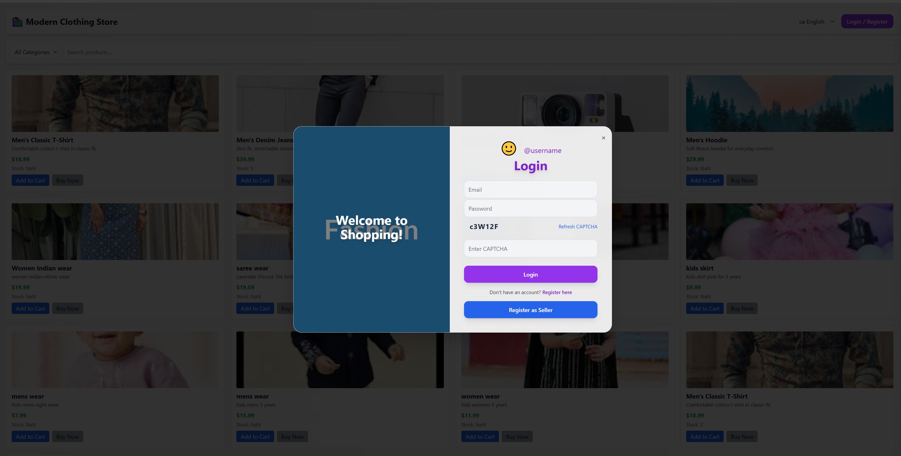
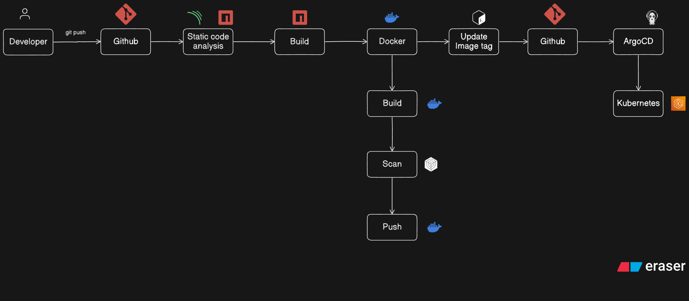

# ECOMMERCE- 🛒

A modern, full-stack clothing ecommerce web application built with **React**, **Flask**, and **MongoDB**. This project features user authentication, product browsing by category, a shopping cart, and secure checkout.



---

## 🚀 Features

- **User Authentication**
  - Register and log in with email and password
  - Secure session management

- **Product Catalog**
  - Browse products by category (Men, Women, Kids)
  - Product details and images

- **Shopping Cart**
  - Add/remove products to cart
  - View cart and total price

- **Responsive UI**
  - Modern, mobile-friendly design using Tailwind CSS
  - Themed login screen with background image

- **Backend API**
  - Flask REST API for authentication and product management
  - MongoDB for fast, scalable data storage

---

## 🛠️ Tech Stack

- **Frontend:** React, Tailwind CSS, Axios
- **Backend:** Python, Flask, Flask-CORS
- **Database:** MongoDB (Atlas or local)
- **Other:** JWT/Session storage, RESTful APIs

---

## 📦 Getting Started

### 1. Clone the repository

```bash
git clone https://github.com/nlokeshbabu1/ECOMMERCE-.git
cd ECOMMERCE-
```

### 2. Backend Setup (Flask)

Install dependencies:

```bash
cd backend
python3 -m venv venv
source venv/bin/activate  # On Windows: venv\Scripts\activate
pip install -r requirements.txt
```

Set up your MongoDB connection string in your Flask config or `.env` file.

Start the Flask server:

```bash
python app.py
```

### 3. Frontend Setup (React)

```bash
cd ../frontend
npm install
npm start
```

By default, the React app runs on [http://localhost:3000](http://localhost:3000) and connects to the backend at [http://localhost:5000](http://localhost:5000).

---

## 🌐 Environment Variables

- **Flask API:** Set your MongoDB connection string as an environment variable or in `config.py`.
- **React App:** You can configure API base URLs in a `.env` file if needed.

---

## 🖼️ Customizing Images

- Login background image: `public/login-bg.jpg`
- Product images: Stored as URLs in MongoDB product documents. You can use your own images by providing a public link.

---

## ✨ Project Structure

```
ECOMMERCE-/
│
├── backend/
│   ├── app.py
│   ├── requirements.txt
│   └── ...
│
├── frontend/
│   ├── src/
│   │   └── App.js
│   ├── public/
│   │   └── login-bg.jpg
│   └── ...
│
└── README.md
```

---

## ⚙️ DevSecOps Pipeline

Below is an overview of the DevSecOps pipeline implemented for this project. This pipeline ensures secure, automated, and reliable delivery of application changes using best practices in CI/CD and security.



### Pipeline Stages

1. **Developer**: Code is written and committed.
2. **GitHub**: Source code is pushed to the GitHub repository.
3. **Static Code Analysis**: Automated tools perform static code analysis to identify code issues and vulnerabilities.
4. **Build**: The build process is triggered (npm or equivalent for Node.js projects).
5. **Docker**: Application is containerized using Docker.
    - **Build**: Docker image is built.
    - **Scan**: The image is scanned for vulnerabilities.
    - **Push**: Secure image is pushed to a container registry.
6. **Update Image Tag**: Image tags are updated to track new versions.
7. **GitHub**: Updated configuration is pushed back to GitHub.
8. **ArgoCD**: ArgoCD pulls the latest configuration and deploys to the Kubernetes cluster.
9. **Kubernetes**: The application is deployed/updated in the cluster, ensuring high availability and scalability.

---

## 🧑‍💻 Contributing

Pull requests are welcome! For major changes, please open an issue first to discuss what you would like to change.

---

## 📄 License

[MIT](LICENSE)

---

## 🙏 Acknowledgments

- [Unsplash](https://unsplash.com/) for demo images
- [SoundJay](https://www.soundjay.com/) for sound effects
- [Tailwind CSS](https://tailwindcss.com/) for styling

---